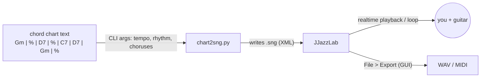

# chart2sng

Turn a plain-text chord chart into a [JJazzLab](https://www.jjazzlab.org/) song file (`.sng`), so you get a backing track to improvise over in seconds — and so an AI assistant can generate one for you from a photo of a whiteboard.



## Requirements

- Python 3.8+ (standard library only)
- JJazzLab 5.x with its bundled rhythms in `~/JJazzLab/Rhythms` (tested with 5.2.1)

## Usage

```sh
./chart2sng.py "Gm | % | D7 | % | C7 | D7 | Gm | %" \
    --name GmBlues --tempo 76 --rhythm SlowBlues.S594.sst --choruses 8 -o GmBlues.sng
jjazzlab GmBlues.sng
```

Chart syntax:

| Token | Meaning |
|---|---|
| `\|` | bar line |
| `%` | repeat previous bar |
| `C7 D7` | several chords in one bar split it evenly (2 beats each in 4/4) |

Options:

| Option | Default | Notes |
|---|---|---|
| `--name` | `Backing` | song name |
| `--tempo` | `80` | BPM |
| `--rhythm` | `SlowBlues.S594.sst` | style file name from `~/JJazzLab/Rhythms`, e.g. `KoolShuffle.STY`, `SimpleShuffle.S643.bcs` |
| `--choruses` | `8` | times through the chart |
| `-o` | `<name>.sng` | output path |

Each chorus becomes its own song part. The style variation climbs `Main A` → `Main D` every two choruses, with a fill at the end of each chorus so you always hear where the form restarts.

Examples, all on the same 8-bar G-minor progression (`Gm Gm D7 D7 C7 D7 Gm Gm`):

| File | Style | BPM |
|---|---|---|
| `examples/GmBlues.sng` | `SlowBlues.S594.sst` | 76 |
| `examples/GmCountryTrain.sng` | `CountryTrain Bt.sty` (train beat) | 132 |
| `examples/GmRootRock.sng` | `RootRock.S117.bcs` | 112 |
| `examples/GmHardRock.sng` | `HardRock.S512.bcs` | 118 |
| `examples/GmPowerRock.sng` | `PowerRock.STY` | 128 |

## Caveats

- The `.sng` format is JJazzLab's internal XStream serialization, not a documented interchange format. It works with 5.2.1 but could break with future versions.
- 4/4 only, one section per song.
- Rendering audio still goes through the JJazzLab GUI.

## Roadmap

- MCP server exposing `create_backing_track(chart, style, tempo, choruses)`
- Headless audio path (MMA → MIDI → FluidSynth → WAV)
- Multiple sections and time signatures

## License

[LGPL-2.1-or-later](LICENSE), matching JJazzLab's license.
